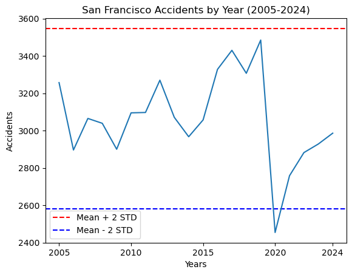
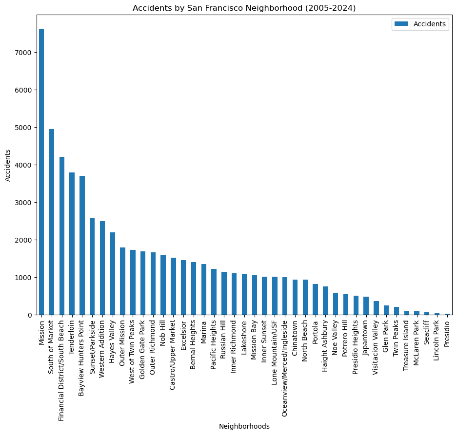
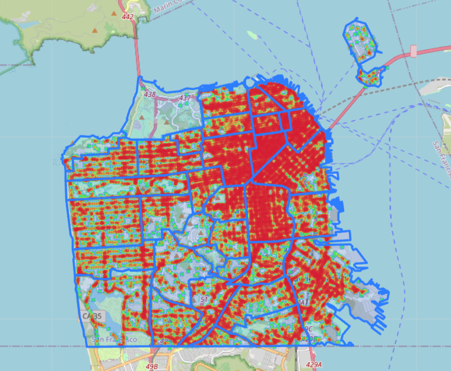
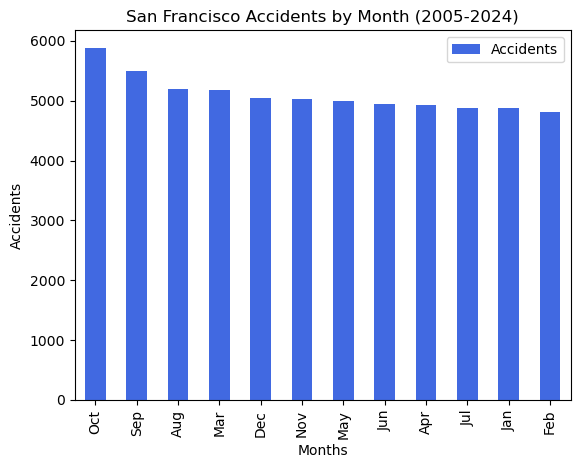

# 🚦 San Francisco Traffic Accident Analysis (2005–2024)

This project analyzes nearly two decades of traffic collision data in **San Francisco**, highlighting injury and fatality trends by year, month, neighborhood, police district, and more. Using Python and libraries like `pandas`, `matplotlib`, `folium`, and `geopandas`, we generate visuals and spatial representations of high-risk areas.

---

## 📊 Accidents Over Time (Yearly Trends)

A line chart visualizes the yearly accident counts from 2005–2024, including 2x standard deviation thresholds to spot anomalies.

---

## 🏘️ Accidents by Neighborhood

A bar chart ranking neighborhoods by total accident count. Notably, **Mission**, **South of Market**, and **Financial District/South Beach** have the highest incident rates.

---

## 🗺️ Spatial Heatmap of Accidents

A heatmap overlays accident intensity on a map of San Francisco using `folium` and shapefiles of planning neighborhoods. Red zones indicate higher collision density.

---

## 📅 Accidents by Month

Which months are most dangerous? This bar chart shows accident counts by month across all years.

> **Observation:** October and September show significantly higher incident rates.

---

## 📍 Other Analyses Included

### 🕓 Time of Day
- Converted `collision_time` to military seconds to study hourly trends.

### 🚓 Police Districts
- Ranked districts by accident count.
- Visualized using bar and pie charts.

### 📆 Day of Week
- Evaluated total injuries and fatalities by day.
- Saturdays and Fridays tend to be more dangerous.

### 🌦️ Weather Conditions
- Analyzed which weather types correlate with higher injury/fatality rates.

### 🔁 Collision Types
- Identified the top 3 collision types each year.
- Stacked bar chart visualizes shifting trends.

### ⚠️ Fatality Risk in Injury Crashes
- Computed the percentage of injury crashes that resulted in fatalities using pie chart.

---

## 🛠️ Tools & Libraries

- `pandas`, `matplotlib`, `numpy`, `scipy`
- `geopandas`, `folium`, `HeatMap`
- CSV data and shapefiles sourced locally and via [Kaggle](https://www.kaggle.com/datasets/broach/san-francisco-neighborhood-maps)

---

## 👤 Authors

- Josh Richardson  
- Tsedenia Mekonnen
- Trayshawn Mitchell

---

## 📄 License

MIT License – use freely with attribution.

